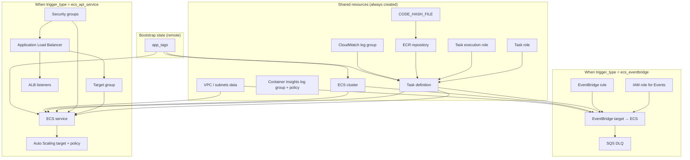
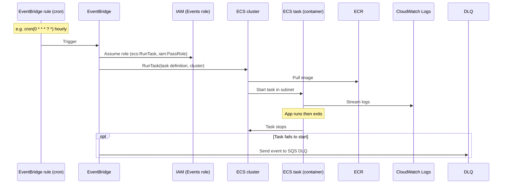
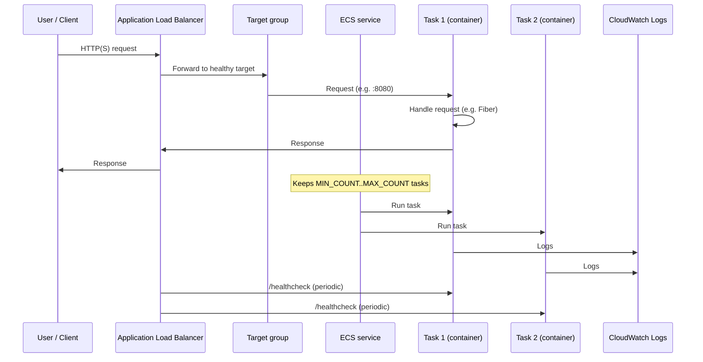

# Architecture: Golang AWS ECS Codebase

This document explains the codebase with workflow diagrams, step-by-step flows, and the AWS concepts used (ECS, tasks, and dependencies).

---

## 1. Core AWS Concepts

### 1.1 ECS (Elastic Container Service)

**ECS** is AWS’s container orchestration service. It runs and manages Docker containers without you managing servers (with Fargate) or on your own EC2 instances.

- **Cluster**: A logical grouping of capacity (Fargate or EC2) and the place where **tasks** and **services** run. This project creates one cluster per app (e.g. `my-test-project-staging`).
- **Task definition**: A blueprint for a runnable unit. It specifies image, CPU/memory, IAM roles, logging, env vars, and ports. It does **not** run by itself.
- **Task**: A single **running** instance of a task definition. ECS starts a task when something asks it to (e.g. EventBridge rule or an ECS service keeping N tasks running).
- **Service** (optional): Keeps a desired number of tasks running in a cluster, restarts them if they fail, and can attach to a load balancer. Used only when `trigger_type = "ecs_api_service"`.

So: **Cluster** contains **Tasks** (and optionally an **ECS Service**). Each task is one instance of a **Task definition**.

### 1.2 Where the ECS service Terraform resource fits

The **`aws_ecs_service`** Terraform resource (`aws_ecs_service.ecs_service` in `terraform/main/ecs_api_service.tf`) is the ECS **Service** in this architecture. It is created **only when `trigger_type = "ecs_api_service"`**.

- **Placement in the hierarchy**:  
  **Cluster** → **ECS Service** (this Terraform resource) → **Tasks**.  
  The service runs *inside* the cluster, uses the same **task definition** as the EventBridge path, and maintains a desired number of **tasks** (e.g. `MIN_COUNT`..`MAX_COUNT`). It is the “always-on” path; the EventBridge path has no service and only starts one-off tasks on a schedule.

- **Relations in Terraform**: The service depends on: the ECS cluster, the task definition, the target group (for the load balancer), security groups, and subnets. The ALB and target group are created in the same file and the service’s `load_balancer` block attaches the service to that target group so ECS registers/deregisters task IPs as tasks start and stop.

- **Summary**:  
  | Trigger type         | ECS service Terraform resource | Who starts tasks                          |
  |----------------------|---------------------------------|-------------------------------------------|
  | `ecs_eventbridge`    | **Not created**                 | EventBridge rule (RunTask on schedule)     |
  | `ecs_api_service`    | **Created** (`ecs_api_service.tf`)| ECS service (keeps N tasks, ALB traffic) |

### 1.3 Task definition vs task (instance)

| Concept | What it is | Terraform resource |
|--------|-------------|---------------------|
| **Task definition** | Blueprint (image, CPU, memory, roles, ports) | `aws_ecs_task_definition.task_definition` |
| **Task** | A running container (instance of that blueprint) | Not created by Terraform; created by EventBridge or ECS service at runtime |

The same task definition is used in both trigger types; only **how** and **how many** tasks are run changes.

### 1.4 Launch types (where tasks run)

- **FARGATE**: Serverless. AWS runs your container on managed infrastructure. You only choose CPU/memory.
- **FARGATE_SPOT**: Same as Fargate but with spare capacity; cheaper, can be interrupted.
- **EC2**: Your containers run on EC2 instances you (or your org) register with the cluster. Requires an EC2 capacity provider.

### 1.5 IAM roles used by ECS

- **Task execution role** (`ecs_task_execution_role`): Used by the ECS agent **before** your container starts. It pulls the image from ECR, writes logs to CloudWatch, and can read secrets. Your app code does **not** assume this role.
- **Task role** (`ecs_task_role`): Assumed by your **running container**. Used for app permissions (S3, Secrets Manager, etc.). This is the identity of your code at runtime.

### 1.6 Other dependencies

- **ECR (Elastic Container Registry)**: Docker image registry. Terraform creates the repo; the deploy pipeline builds the image and pushes it with a tag (e.g. code hash).
- **CloudWatch Logs**: Log group for container stdout/stderr. Referenced in the task definition so every task sends logs there.
- **VPC / Subnets**: Tasks run in a VPC. This project uses either the default VPC or a custom one (via `VPC_NAME`). EventBridge and API-service tasks use **public** subnets (for simplicity; production may use private subnets + NAT).

---

## 2. High-level deployment workflow

Deployment is driven by `deploy.sh` (or the GitHub Actions workflow), which loads config and then runs Terraform.

```mermaid
flowchart TB
  subgraph entry["Entry (CI or local)"]
    A[ENVIRONMENT=staging or prod\n./deploy.sh or GitHub Action]
  end

  subgraph config["Config"]
    B[source config.global]
    C[source config.<env>]
    D[Export all env vars as TF_VAR_*]
  end

  subgraph terraform_flow["Terraform flow"]
    E{FLAG_DESTROY?}
    F[_run_terraform_destroy.sh]
    G[_run_terraform_create.sh]
  end

  subgraph bootstrap["Bootstrap (create)"]
    H[terraform/bootstrap: init + apply]
    I[App Registry application + app_tags]
  end

  subgraph main["Main (create)"]
    J[terraform/main: backend + app_bootstrap.tf generated]
    K[terraform init]
    L[terraform apply]
    M{Apply cycle?}
    N[Two-phase: trigger_type=none then restore]
  end

  A --> B --> C --> D --> E
  E -->|yes| F
  E -->|no| G
  G --> H --> I --> J --> K --> L --> M
  M -->|cycle| N --> L
  M -->|ok| end
  M -->|other error| fail
```

**Step-by-step (create path):**

1. **Entry**: You run `ENVIRONMENT=staging ./deploy.sh` (or push to `main` / tag for prod; GitHub runs the same flow with OIDC).
2. **Config**: `deploy.sh` sources `config.global` and `config.${ENVIRONMENT}` (e.g. `config.staging`), then exports every environment variable as `TF_VAR_<name>` so Terraform receives them as variables.
3. **Create vs destroy**: If `./deploy.sh -d` was used, it runs `_run_terraform_destroy.sh`; otherwise `_run_terraform_create.sh`.
4. **Bootstrap**: Script `cd`s to `terraform/bootstrap`, generates `backend.tf`, runs `terraform init` and `terraform apply`. This creates the **App Registry** application and outputs `app_tags`. Those tags are used later so all main resources are tagged for cost tracking.
5. **Main**: Script `cd`s to `terraform/main`, generates `backend.tf` and `app_bootstrap.tf` (remote state pointing at bootstrap state), runs `terraform init` and `terraform apply`.
6. **Two-phase apply**: If the first apply fails with a cycle (e.g. when switching `trigger_type`), the script sets `TF_VAR_trigger_type=none`, applies again (drops one trigger’s resources), restores the desired `trigger_type`, and applies a third time.

---

## 3. Terraform resource dependency (create path)

This diagram shows how the main Terraform resources depend on each other. Optional (trigger-specific) resources are noted.



**Order of creation (simplified):**

1. **Bootstrap**: App Registry → `app_tags`.
2. **Data**: VPC/subnets (from `main.tf` + `variables.tf`).
3. **Logs & IAM**: CloudWatch log groups, task execution role, task role, Container Insights policy.
4. **ECR**: Repository; then `null_resource.push_image` (build + push image with tag = `CODE_HASH_FILE` hash).
5. **Task definition**: Depends on log group and push_image; references ECR image tag and both IAM roles.
6. **Cluster**: ECS cluster (with Container Insights).
7. **Trigger-specific** (only one set exists at a time):
   - **ecs_eventbridge**: EventBridge rule, target (cluster + task definition), DLQ, IAM role for `events.amazonaws.com`.
   - **ecs_api_service**: Security groups, ALB, target group, ECS service (with desired count), auto scaling, listeners (and optionally HTTPS + Route53 if `API_DOMAIN` is set).

---

## 4. Runtime workflow: EventBridge trigger (`trigger_type = ecs_eventbridge`)

When the trigger is EventBridge, **no ECS service** exists. A **scheduled rule** tells EventBridge to run a task in the cluster at a fixed schedule.



**Step-by-step:**

1. **Schedule**: A CloudWatch Events (EventBridge) rule runs on a cron (e.g. hourly). Rule state can be `DISABLED` for non-prod.
2. **EventBridge**: When the rule fires, EventBridge uses the **execution role** (assumed by `events.amazonaws.com`) to call `ecs:RunTask` and `iam:PassRole` on the task execution role.
3. **RunTask**: ECS starts a **task** in the cluster: it pulls the image from ECR, places the task in the configured subnets (public, with public IP for Fargate), and starts the container.
4. **Task**: The container runs your Go binary. Logs go to the task definition’s `awslogs` log group. The process runs until it exits (batch/cron style).
5. **After exit**: The task stops and disappears. No long-lived service. Next run is at the next schedule tick.
6. **Failure**: If RunTask fails (e.g. resource limits), the event can be sent to the SQS DLQ (dead-letter queue) for the rule.

**Concepts used:** ECS **cluster**, **task definition**, **task** (ephemeral), **EventBridge rule/target**, **task execution role** (for pull + logs), **task role** (for app AWS calls).

---

## 5. Runtime workflow: API service trigger (`trigger_type = ecs_api_service`)

When the trigger is API service, an **ECS service** keeps a desired number of tasks running, and an **ALB** sends HTTP traffic to those tasks.



**Step-by-step:**

1. **ALB**: Receives HTTP (and optionally HTTPS if `API_DOMAIN` is set). It’s in public subnets with a security group allowing 80/443.
2. **Target group**: Registered with the ECS service. Targets are the **task IPs** (and port 8080). Type is `ip`. Health check is HTTP to `/healthcheck` on the same port.
3. **ECS service**: Ensures a number of tasks between `MIN_COUNT` and `MAX_COUNT` are running. Each task is an instance of the same task definition. The service registers/deregisters task IPs with the target group.
4. **Request path**: User → ALB → target group → one of the healthy tasks (e.g. Fiber listening on 8080). Response goes back the same way.
5. **Scaling**: Application Auto Scaling adjusts `desired_count` (e.g. by CPU). ECS starts or stops tasks; they register/unregister from the target group.
6. **Logs**: Same as EventBridge: each task streams to the CloudWatch log group defined in the task definition.

**Concepts used:** ECS **cluster**, **task definition**, **ECS service**, **tasks** (long-lived), **ALB**, **target group** (ip), **security groups** (ALB + ECS), **task execution role** and **task role** as before.

---

## 6. Single diagram: ECS and dependent concepts

This ties together ECS and the surrounding AWS services in one picture.

```mermaid
flowchart LR
  subgraph triggers["How tasks are started"]
    EB[EventBridge rule\n(schedule)]
    SVC[ECS service\n(desired count)]
  end

  subgraph ecs["ECS"]
    CL[Cluster]
    TD[Task definition\n(image, CPU, memory,\nroles, logs, ports)]
    T1[Task]
    T2[Task]
  end

  subgraph identity["IAM"]
    EXEC[Task execution role\n(pull image, logs)]
    TASK_R[Task role\n(app permissions)]
    EB_R[Events role\n(RunTask, PassRole)]
  end

  subgraph storage_network["Storage & network"]
    ECR[ECR\n(image)]
    CW[CloudWatch Logs]
    VPC[VPC / subnets]
  end

  subgraph api_optional["API path (ecs_api_service only)"]
    ALB[ALB]
    TG[Target group]
  end

  EB --> EB_R
  EB --> CL
  SVC --> CL
  CL --> T1
  CL --> T2
  TD --> T1
  TD --> T2
  EXEC --> TD
  TASK_R --> TD
  ECR --> TD
  CW --> TD
  VPC --> T1
  VPC --> T2
  ALB --> TG
  TG --> T1
  TG --> T2
```

- **Triggers**: EventBridge (schedule) or ECS service (always-on).
- **ECS**: Cluster + task definition + one or more tasks.
- **IAM**: Execution role (startup: ECR, logs), task role (runtime: app), and for EventBridge an extra role for Events to call RunTask.
- **Storage/network**: ECR (image), CloudWatch (logs), VPC/subnets (where tasks run).
- **API path**: Only for `ecs_api_service`: ALB and target group in front of tasks.

---

## 7. File-to-concept map

| File / area | What it defines |
|-------------|------------------|
| `deploy.sh` | Entry: config load, TF_VAR export, call create or destroy script. |
| `_run_terraform_create.sh` | Bootstrap apply, then main apply; two-phase apply on cycle. |
| `_run_terraform_destroy.sh` | Main destroy, then bootstrap destroy. |
| `terraform/bootstrap/main.tf` | App Registry application; outputs `app_tags`. |
| `terraform/main/main.tf` | Providers, VPC/subnet data sources, `local.vpc_id`. |
| `terraform/main/variables.tf` | All inputs (e.g. `trigger_type`, `APP_IDENT`, `LAUNCH_TYPE`, `VPC_NAME`). |
| `terraform/main/ecs.tf` | ECS cluster. |
| `terraform/main/ecs_task.tf` | Task definition (image from ECR + hash, CPU/memory, execution + task role, log group, port 8080). |
| `terraform/main/ecs_iam.tf` | Task execution role, task role, Container Insights policy. |
| `terraform/main/ecr.tf` | ECR repo, lifecycle policy, `null_resource.push_image` (build + push). |
| `terraform/main/cloudwatch_log.tf` | Log group for app logs; Container Insights log group + IAM. |
| `terraform/main/ecs_eventbridge.tf` | EventBridge rule, target (ECS), DLQ, IAM role for Events (only if `trigger_type = ecs_eventbridge`). |
| `terraform/main/ecs_api_service.tf` | Security groups, ALB, target group, ECS service, auto scaling, listeners, optional HTTPS/Route53 (only if `trigger_type = ecs_api_service`). |

Together, this gives you the deployment workflow, the two runtime workflows, and how ECS, tasks, and dependencies fit into the codebase.
